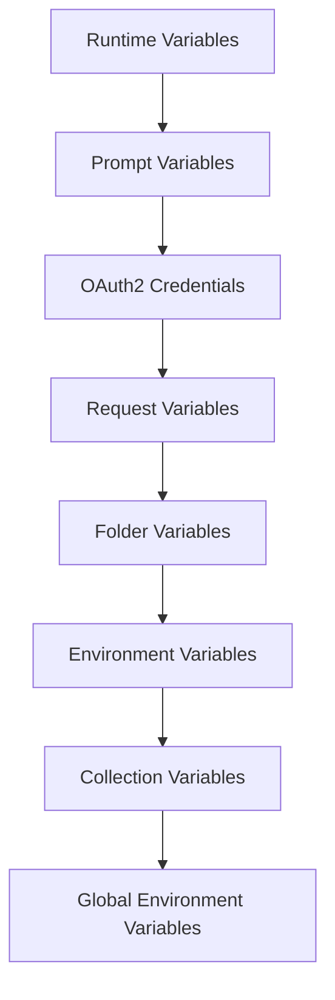

Bruno provides a powerful variable system with multiple scopes and precedence levels. Understanding how variables work is essential for building dynamic, maintainable API collections.

## Variable Scopes

Bruno supports six variable scopes, each with different use cases and lifetimes:

<CardGroup cols={3}>
  <Card title="Environment" icon="layer-group">
    Environment-specific values
  </Card>
  <Card title="Global Environment" icon="earth-americas">
    Shared across all environments
  </Card>
  <Card title="Collection" icon="folder-tree">
    Collection-wide variables
  </Card>
  <Card title="Folder" icon="folder">
    Folder-level variables
  </Card>
  <Card title="Request" icon="file">
    Request-specific variables
  </Card>
  <Card title="Runtime" icon="bolt">
    Temporary execution variables
  </Card>
</CardGroup>

## Variable Precedence

When multiple scopes define the same variable, Bruno uses the following precedence order (highest to lowest):



<Note>
  Runtime variables have the highest precedence and will override all other scopes.
</Note>

## Environment Variables

Environment variables are specific to each environment (dev, staging, production, etc.) and are the most commonly used variable type.

### Setting Environment Variables

<Tabs>
  <Tab title="Via UI">
    1. Click the environment dropdown
    2. Select "Configure"
    3. Add or edit variables
    4. Save changes
  </Tab>
  
  <Tab title="Via Scripts">
    ```javascript
    // Set environment variable
    bru.setEnvVar('apiToken', 'abc123');
    
    // Set persistent variable (saved to disk)
    bru.setEnvVar('refreshToken', 'xyz789', { persist: true });
    
    // Get environment variable
    const token = bru.getEnvVar('apiToken');
    
    // Check if variable exists
    if (bru.hasEnvVar('apiToken')) {
      console.log('Token is set');
    }
    
    // Delete environment variable
    bru.deleteEnvVar('apiToken');
    
    // Get all environment variables
    const allVars = bru.getAllEnvVars();
    
    // Clear all environment variables
    bru.deleteAllEnvVars();
    ```
  </Tab>
</Tabs>

### Persistent Variables

By default, variables set via scripts are temporary. Use the `persist` option to save them permanently:

```javascript
// Temporary - lost after execution
bru.setEnvVar('sessionId', '12345');

// Persistent - saved to environment file
bru.setEnvVar('accessToken', 'token123', { persist: true });
```

<Warning>
  Persistent variables must be strings. Objects and arrays cannot be persisted.
</Warning>

## Global Environment Variables

Global environment variables are shared across all environments, useful for values that don't change between dev/staging/production.

```javascript
// Set global environment variable
bru.setGlobalEnvVar('apiVersion', 'v2');
bru.setGlobalEnvVar('baseUrl', 'https://api.example.com');

// Get global environment variable
const version = bru.getGlobalEnvVar('apiVersion');

// Delete global environment variable
bru.deleteGlobalEnvVar('apiVersion');

// Get all global environment variables
const allGlobals = bru.getAllGlobalEnvVars();

// Clear all global environment variables
bru.deleteAllGlobalEnvVars();
```

## Runtime Variables

Runtime variables are temporary and exist only during request execution. They have the highest precedence and are perfect for passing data between requests.

### Basic Usage

```javascript
// Set runtime variable
bru.setVar('userId', '12345');
bru.setVar('orderData', {
  items: ['item1', 'item2'],
  total: 99.99
});

// Get runtime variable
const userId = bru.getVar('userId');

// Check if variable exists
if (bru.hasVar('userId')) {
  console.log('User ID is set');
}

// Delete runtime variable
bru.deleteVar('userId');

// Get all runtime variables
const allVars = bru.getAllVars();

// Clear all runtime variables
bru.deleteAllVars();
```

### Passing Data Between Requests

<Steps>
  <Step title="Request 1: Login">
    ```javascript
    // In post-response script
    const response = res.getBody();
    bru.setVar('authToken', response.token);
    bru.setVar('userId', response.user.id);
    ```
  </Step>
  
  <Step title="Request 2: Get Profile">
    ```javascript
    // In pre-request script
    const token = bru.getVar('authToken');
    req.setHeader('Authorization', `Bearer ${token}`);
    
    // In URL
    // GET /users/{{userId}}/profile
    ```
  </Step>
  
  <Step title="Request 3: Update Profile">
    ```javascript
    // Runtime variables available across entire execution
    const userId = bru.getVar('userId');
    const body = req.getBody();
    body.userId = userId;
    req.setBody(body);
    ```
  </Step>
</Steps>

## Collection Variables

Collection variables are defined at the collection level and are available to all requests in the collection.

### In collection.bru

```plaintext
vars:pre-request {
  collection_pre_var: collection_pre_var_value
  collection_pre_var_token: {{request_pre_var_token}}
  collection-var: collection-var-value
}
```

### In Scripts

```javascript
// Set collection variable
bru.setCollectionVar('apiBaseUrl', 'https://api.example.com');
bru.setCollectionVar('timeout', 5000);

// Get collection variable
const baseUrl = bru.getCollectionVar('apiBaseUrl');

// Check if variable exists
if (bru.hasCollectionVar('apiBaseUrl')) {
  console.log('Base URL is configured');
}

// Delete collection variable
bru.deleteCollectionVar('apiBaseUrl');

// Get all collection variables
const allVars = bru.getAllCollectionVars();

// Clear all collection variables
bru.deleteAllCollectionVars();
```

## Folder Variables

Folder variables are inherited by all requests within a folder and its subfolders.

```javascript
// Get folder variable (read-only in scripts)
const folderApiKey = bru.getFolderVar('apiKey');
const folderEndpoint = bru.getFolderVar('endpoint');
```

<Note>
  Folder variables can only be read in scripts, not modified. Define them in folder configuration.
</Note>

## Request Variables

Request variables are specific to a single request and have the lowest precedence among regular variables.

```javascript
// Get request variable (read-only in scripts)
const requestId = bru.getRequestVar('requestId');
const requestTimeout = bru.getRequestVar('timeout');
```

## Variable Interpolation

Use `{{variableName}}` syntax to interpolate variables in requests:

### In URLs

```plaintext
GET {{baseUrl}}/users/{{userId}}/orders/{{orderId}}
```

### In Headers

```plaintext
Authorization: Bearer {{authToken}}
X-API-Key: {{apiKey}}
X-Request-ID: {{requestId}}
```

### In Body

```json
{
  "userId": "{{userId}}",
  "email": "{{userEmail}}",
  "timestamp": "{{timestamp}}"
}
```

### Programmatic Interpolation

```javascript
// Interpolate strings manually
const interpolated = bru.interpolate('User ID: {{userId}}');

// Interpolate objects
const template = {
  url: '{{baseUrl}}/api',
  token: '{{token}}'
};
const interpolated = bru.interpolate(template);
```

## Process Environment Variables

Access system environment variables from your OS:

```javascript
// Get process environment variable
const nodeEnv = bru.getProcessEnv('NODE_ENV');
const home = bru.getProcessEnv('HOME');

// Use in interpolation
// {{process.env.API_KEY}}
```

## Variable Naming Rules

<Warning>
  Variable names must follow these rules:
  - Only alphanumeric characters, hyphens (`-`), underscores (`_`), and dots (`.`)
  - No spaces or special characters
  - Case-sensitive
</Warning>

### Valid Names

```javascript
bru.setVar('userId', '123');           // ✓
bru.setVar('api-key', 'abc');          // ✓
bru.setVar('user_email', 'x@y.com');   // ✓
bru.setVar('config.timeout', 5000);    // ✓
```

### Invalid Names

```javascript
bru.setVar('user id', '123');          // ✗ Contains space
bru.setVar('api@key', 'abc');          // ✗ Contains @
bru.setVar('user$name', 'john');       // ✗ Contains $
```

## Advanced Patterns

### Conditional Variables

```javascript
// Set variables based on environment
const envName = bru.getEnvName();

if (envName === 'production') {
  bru.setVar('apiUrl', 'https://api.prod.example.com');
  bru.setVar('debug', false);
} else if (envName === 'staging') {
  bru.setVar('apiUrl', 'https://api.staging.example.com');
  bru.setVar('debug', true);
} else {
  bru.setVar('apiUrl', 'http://localhost:3000');
  bru.setVar('debug', true);
}
```

### Variable Transformations

```javascript
// Get and transform variables
const email = bru.getEnvVar('userEmail');
const domain = email.split('@')[1];
bru.setVar('emailDomain', domain);

// Combine variables
const firstName = bru.getVar('firstName');
const lastName = bru.getVar('lastName');
bru.setVar('fullName', `${firstName} ${lastName}`);

// Parse and restructure
const jsonString = bru.getEnvVar('configJson');
const config = JSON.parse(jsonString);
bru.setVar('apiEndpoint', config.api.endpoint);
bru.setVar('apiVersion', config.api.version);
```

### Dynamic Variable Generation

```javascript
// Generate timestamps
bru.setVar('timestamp', Date.now());
bru.setVar('isoTimestamp', new Date().toISOString());

// Generate unique IDs
const { v4: uuidv4 } = require('uuid');
bru.setVar('requestId', uuidv4());

// Generate random values
const { nanoid } = require('nanoid');
bru.setVar('nonce', nanoid());
```

### Variable Cleanup

```javascript
// Clean up after request sequence
const tempVars = ['sessionId', 'tempToken', 'nonce'];
tempVars.forEach(varName => {
  if (bru.hasVar(varName)) {
    bru.deleteVar(varName);
  }
});

// Conditional cleanup
if (res.getStatus() === 401) {
  // Clear authentication variables on auth failure
  bru.deleteVar('authToken');
  bru.deleteEnvVar('sessionToken');
}
```

## Common Patterns

<AccordionGroup>
  <Accordion title="Token Management">
    ```javascript
    // Store tokens after login
    const response = res.getBody();
    bru.setEnvVar('accessToken', response.access_token);
    bru.setEnvVar('refreshToken', response.refresh_token, { persist: true });
    bru.setVar('tokenExpiry', Date.now() + (response.expires_in * 1000));
    
    // Use tokens in subsequent requests
    const token = bru.getEnvVar('accessToken');
    req.setHeader('Authorization', `Bearer ${token}`);
    ```
  </Accordion>

  <Accordion title="Pagination">
    ```javascript
    // Track pagination state
    const currentPage = parseInt(bru.getVar('currentPage') || '1');
    const response = res.getBody();
    
    bru.setVar('currentPage', currentPage + 1);
    bru.setVar('totalPages', response.pagination.total_pages);
    bru.setVar('hasMore', response.pagination.has_more);
    ```
  </Accordion>

  <Accordion title="Resource IDs">
    ```javascript
    // Extract and store resource IDs
    const response = res.getBody();
    
    // Store newly created resource ID
    bru.setVar('createdUserId', response.user.id);
    bru.setVar('createdOrderId', response.order.id);
    
    // Use in subsequent requests
    req.setUrl(`{{baseUrl}}/users/${bru.getVar('createdUserId')}`);
    ```
  </Accordion>

  <Accordion title="Environment Detection">
    ```javascript
    // Adapt behavior based on environment
    const env = bru.getEnvName();
    const isProduction = env === 'production';
    
    // Different timeouts per environment
    const timeout = isProduction ? 5000 : 30000;
    req.setTimeout(timeout);
    
    // Different logging
    if (!isProduction) {
      console.log('Request details:', req.getUrl(), req.getHeaders());
    }
    ```
  </Accordion>
</AccordionGroup>

## Best Practices

<Steps>
  <Step title="Choose the Right Scope">
    - Use **environment variables** for environment-specific values (API keys, URLs)
    - Use **runtime variables** for passing data between requests
    - Use **collection variables** for shared constants
    - Use **global variables** for truly universal values
  </Step>
  
  <Step title="Use Descriptive Names">
    ```javascript
    // Good
    bru.setVar('userAuthToken', token);
    bru.setVar('lastOrderId', orderId);
    
    // Bad
    bru.setVar('t', token);
    bru.setVar('id', orderId);
    ```
  </Step>
  
  <Step title="Clean Up Sensitive Data">
    ```javascript
    // Delete sensitive variables after use
    bru.deleteVar('password');
    bru.deleteVar('creditCardNumber');
    bru.deleteVar('ssn');
    ```
  </Step>
  
  <Step title="Document Variable Usage">
    Add comments explaining variable purposes and expected values:
    ```javascript
    // OAuth2 access token - expires in 1 hour
    bru.setEnvVar('accessToken', response.access_token);
    
    // User ID for currently authenticated user
    bru.setVar('currentUserId', response.user_id);
    ```
  </Step>
</Steps>

## Related Resources

<CardGroup cols={2}>
  <Card title="Scripting" icon="code" href="/advanced/scripting">
    Master Bruno's scripting capabilities
  </Card>
  <Card title="Environments" icon="layer-group" href="/concepts/environments">
    Configure and manage environments
  </Card>
  <Card title="Assertions" icon="check" href="/advanced/assertions">
    Test and validate API responses
  </Card>
  <Card title="Workflows" icon="diagram-project" href="/advanced/workflows">
    Build complex request sequences
  </Card>
</CardGroup>